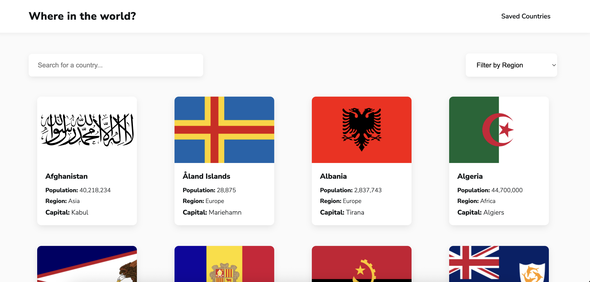
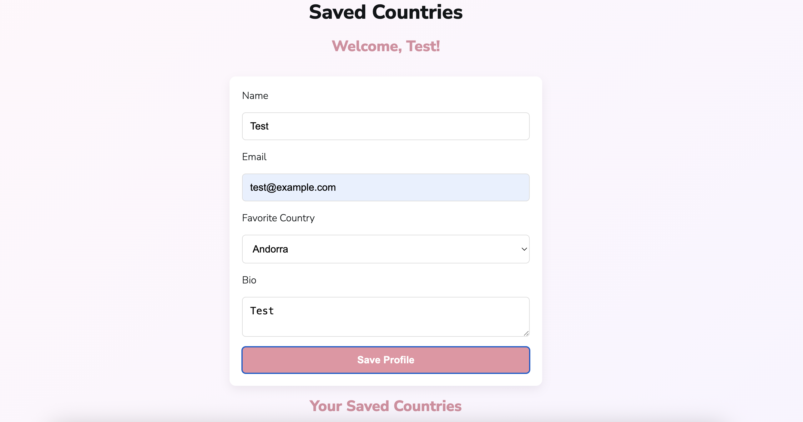
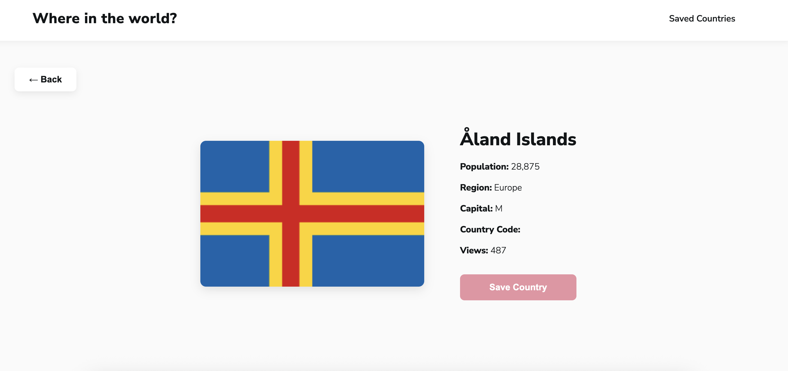

# 🌎 Countries App — Version 4

## 📌 Project Description & Purpose

This project is a full-stack web application that allows users to explore countries around the world, view country information, and save a favorite country to their profile.

The frontend is built with React and Vite, the backend uses Node.js and Express, and user profile information is stored in a PostgreSQL database.

The goal of Version 4 was to connect the frontend, backend, and database and deploy the application so it could be accessed online.

## 🚀 Live Site

Here's the link to view the live app:

https://cerulean-gnome-229116.netlify.app/

## 🖼️ Screenshots

### Home Page


### Saved Countries / Profile


### Country Details


## ✨ Features

* Browse countries from around the world
* Search for countries
* Filter countries by region
* Sort countries alphabetically
* View country flags and information
* View individual country details
* Create a user profile
* Save a favorite country
* Add a personal bio
* Store profile information in a PostgreSQL database
* Navigate between pages using React Router
* Connect the React frontend to an Express REST API

## 🛠️ Tech Stack

### Frontend

* **Languages:** JavaScript, HTML, CSS
* **Framework:** React
* **Build Tool:** Vite
* **Routing:** React Router
* **Deployment:** Netlify

### Server/API

* **Language:** JavaScript
* **Framework:** Express.js
* **Runtime:** Node.js
* **Deployment:** Render

### Database

* **Language:** SQL
* **Database:** PostgreSQL
* **Deployment:** Neon

## 🔹 API Documentation

These are the API endpoints I built:

Method	  Endpoint	                      What it does
GET       /                               Confirms the Countries API server is running
GET	      /api/get-newest-user	          Gets the newest user from users_table
POST    	/api/add-one-user	              Adds a new user to users_table
GET      /api/get-all-saved-countries	    Gets all saved countries
POST	   /api/save-one-country	          Saves a country to saved_countries
POST	   /api/unsave-one-country	        Removes a country from saved_countries
POST	   /api/update-one-country-count	  Increases the view count for a country

### Example Request

The POST /api/add-one-user endpoint accepts user profile information:
```json
{
  "name": "Test User",
  "email": "test@example.com",
  "country_name": "Canada",
  "bio": "Testing Version 4 API"
}
```

### API Documentation Link

The API endpoint documentation is included above.

## 🗄️ Database Schema

Here is the SQL used to create the database table:

```sql
CREATE TABLE users (
    user_id SERIAL PRIMARY KEY,
    name VARCHAR(255),
    country_name VARCHAR(255),
    email VARCHAR(255),
    bio TEXT
);
```

### Database Fields

* `user_id` — Unique identifier for each user
* `name` — User's name
* `country_name` — User's selected country
* `email` — User's email address
* `bio` — User's personal biography

## 💭 Reflections

### What I Learned

I learned how the frontend, backend, and database work together in a full-stack application. 

I also learned how to deploy a React application and connect it to a backend API and PostgreSQL database. This project helped me practice Git, GitHub, REST APIs, environment variables, database connections, and troubleshooting deployment issues.

I also learned how to debug backend.

### What I'm Proud Of

I am proud that I was able to take my application from localhost and deploy it so that it can be accessed online.

I am also proud of getting the frontend, backend, and database components to communicate with each other and save user information. This was a monumental task!

### What Challenged Me

One of my biggest challenges was understanding how all of the different pieces of the application communicate after deployment.

Moving from localhost to a production environment required me to troubleshoot API connections, environment variables, Git branches, database configuration, and deployment settings.

### Future Ideas for How I'd Continue Building This Project

* Add user authentication and secure login
* Allow users to save multiple countries
* Add more detailed country information
* Improve accessibility
* Improve the visual design
* Add better loading and error states
* Add automated tests
* Add additional API endpoints
* Add an AI-powered country recommendation feature

## 🙌 Credits & Shoutouts

* **AnnieCannons** — Course instruction, curriculum, and project guidance
* **REST Countries API** — Country information and data
* **React** — Frontend framework
* **Vite** — Frontend build tool
* **Node.js & Express** — Backend development
* **PostgreSQL / Neon** — Database
* **Netlify** — Frontend deployment
* **Render** — Backend deployment
* **GitHub** — Source code repository and version control

**This project was created as part of my Full-Stack Software Engineering training with AnnieCannons.**
